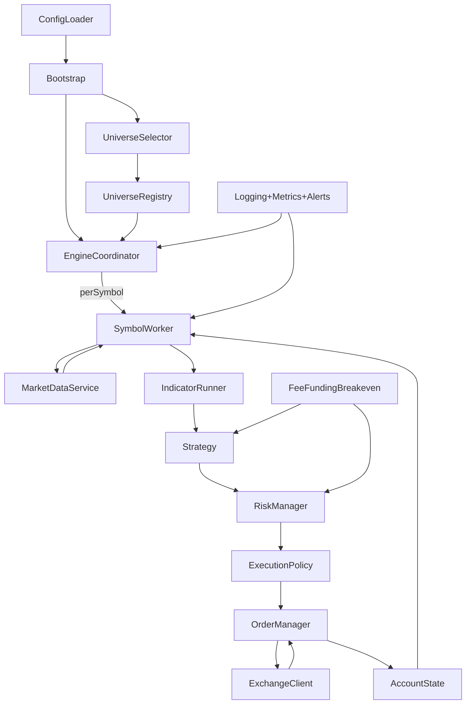

# Architecture (Docs-First)

## Goals

- Modular, pluggable components: **Strategy does not know the exchange**; it only emits **Intents**.
- Single Source of Truth for trading state: positions, orders, balances, exposure, PnL.
- Event-driven engine: candle close, order updates, fills, funding updates, risk halts.
- One codepath for **Backtest / Paper / Live**: only DataSource + Execution/Exchange adapters change.
- Multi-symbol first: per-symbol context isolation; central coordination for rate limits and WS resources.

## Data flow (core loop)

## Key invariants

### Separation of concerns

- **Indicators**: compute values only. No buy/sell decisions.
- **Signal rules**: translate indicator outputs to BUY/SELL/NEUTRAL.
- **Strategy**: uses signals + context and emits `Intent` objects only.
- **Risk**: the only module that can deny an intent (allow/deny + reason).
- **Execution**: turns allowed intents into exchange-specific order requests.
- **OrderManager**: owns order lifecycle state machine and reconciliation.
- **AccountState**: single source of truth for balances/positions/orders.

### Determinism across modes

- Backtest and Paper must share the same Strategy/Risk/Fee modules.
- Differences:
  - **DataSource**: historical store vs live streams.
  - **ExchangeClient**: simulator vs Binance REST/WS.
  - **Slippage**: model-based in backtest/paper, measured/estimated in live.

## Per-symbol isolation

Each symbol gets its own `SymbolContext`:

- Recent candles/market snapshots
- Indicator cache
- Strategy state
- Position state for that symbol (from AccountState)
- Local throttles (e.g., avoid duplicate intents per candle)

